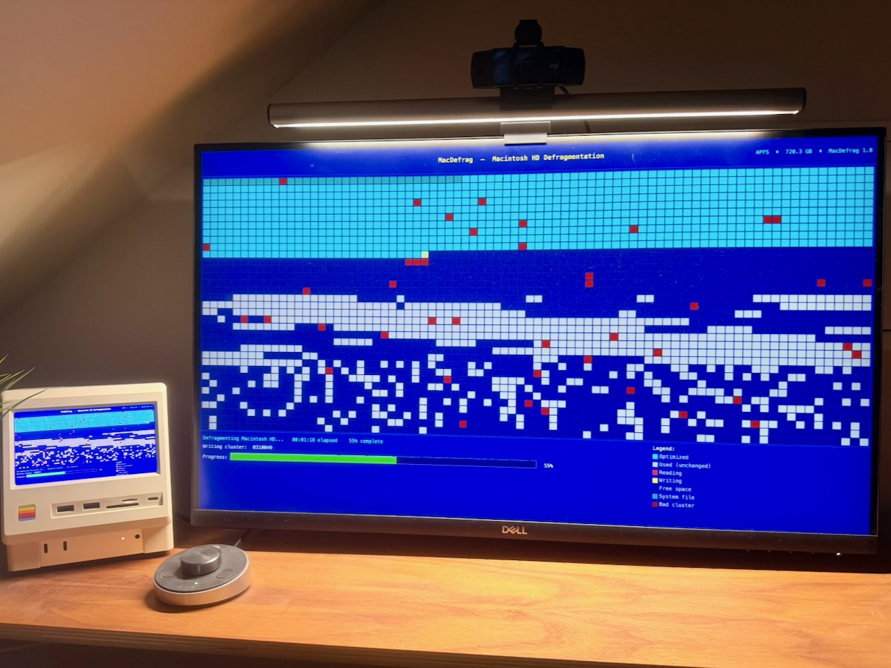

# MacDefrag

A macOS screen saver that recreates the nostalgic DOS-era disk defragmentation experience — complete with a classic blue color scheme, animated cluster map, and real-time status output.

---

It does not make your SSD faster. It does not fix your filesystem. It does not improve your productivity.

What it does do is fill your screen with a lovingly fake retro defrag display: blue DOS-style colors, animated disk clusters, progress bars, status text, and the comforting illusion that your computer is doing something extremely technical and important.

Perfect for retro-PC fans, old-school nerds, or anyone who thinks “watching colored blocks move around” counts as entertainment.

## Features

- **4-phase animation loop** — Scan → Analyze → Defrag → Complete, then seamlessly restarts
- **80 × 35 cluster grid** with a procedurally generated fragmentation pattern using multi-frequency sine waves
- **8 distinct block states**, each with its own DOS-palette color:

  | Color | State |
  |---|---|
  | Bright cyan | Optimized (defragmented) |
  | Light gray | Used (not yet moved) |
  | Teal | System / kernel file |
  | Dark red | Bad sector |
  | Bright red | Read head active |
  | Bright yellow | Write head active |
  | Dim blue | Source cluster after move |
  | Dark blue | Free space |

- **Live status line** with scrolling cluster address counter and elapsed time
- **Progress bar** with percentage readout
- **Monospace aesthetic** using Menlo throughout
- **Preview image** shown in the macOS screen saver picker

---

## Requirements

- macOS 12 Monterey or later
